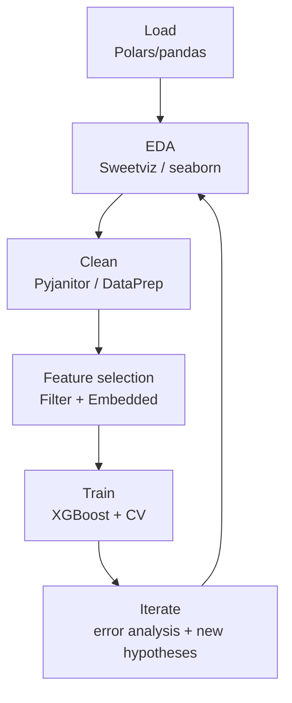
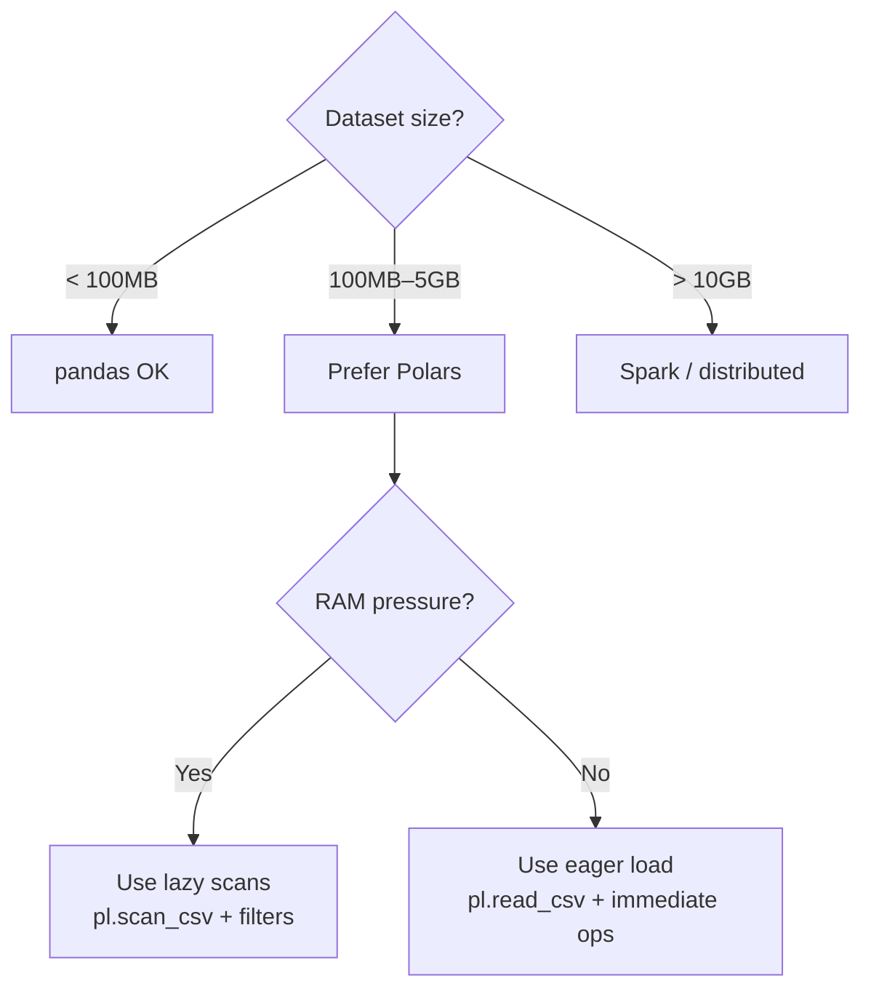

## Quick Wins: Why This Skill Matters

| Benefit | Impact |
| --- | --- |
| **Faster iteration** | Automated EDA (Sweetviz) reveals patterns 50% quicker than manual inspection. |
| **Accuracy boost** | Feature selection cuts 1000s of features to dozens; model accuracy gains 5–15% on tabular tasks. |
| **Fits Colab** | Polars processes medium data 2× faster than pandas; stays within free tier RAM (12–16GB). |
| **Prevents drudgery** | Automated cleaning (Pyjanitor, DataPrep) handles inconsistencies 3× faster. |
| **Catches bias early** | EDA visuals (heatmaps, correlations) spot data leakage and imbalances before training. |
| **Future-proof** | Integrates AI-assisted cleaning (e.g., COMET), aligned with 2025 ML trends. |

### What Problems It Solves (and What It Doesn't)

| **Good fit** | **Bad fit** |
| --- | --- |
| Medium tabular datasets (100MB–5GB) with noise, missing values, or high dims where automated cleaning and selection streamline to fit Colab. | Massive datasets (>10GB) needing distributed tools like Dask—use Spark instead. |
| Imbalanced or skewed data in comps, solved via EDA-driven resampling and statistical selection for better generalization. | Unstructured data (images/text) without prior vectorization—these require domain-specific preprocessing. |
| Quick iteration in time-limited comps, using SOTA automation to sense-make before training. | Pure inference optimization; focus here is pre-training prep, not deployment. |

**Real-world scenarios**

- House price prediction: Clean outliers in property data, select via F-regression, EDA correlations to train robust regression.
- Customer churn: Impute categoricals with DataPrep, dynamic feature selection, violin plots for class imbalances.
- Sales forecasting: Deduplicate time-series, hybrid AI selection, heatmap EDA to uncover seasonal patterns.

### Mental Model & Key Concepts (The Minimum to Think Correctly)

Core primitives: **EDA** (visualize distributions/relations to understand data), **cleaning** (fix errors/missing via automation), **feature selection** (prune via statistical/embedded methods).

They interact sequentially: EDA informs cleaning targets. Clean data enables accurate selection. Selected features feed training without overfitting.



`Pipeline: Load (Polars/pandas) --> EDA (Sweetviz/seaborn) --> Clean (Pyjanitor/impute) --> Select (Dynamic threshold/Featuretools) --> Train (XGBoost with CV)`



### Glossary (Concepts You Must Not Be Fuzzy About)

- EDA: Exploratory Data Analysis — systematic, fast inspection (stats + plots) to detect missingness, outliers, leakage, drift, imbalance, and relationships.
- Sweetviz: Automated EDA report generator; produces quick distributions/correlations/target breakdowns and supports dataset comparison for before/after cleaning diffs.
- Data cleaning: Operations that reduce measurement and representation error (type fixes, dedupe, normalization, imputation, outlier handling) without injecting target leakage.
- COMET (cleaning recommendations): “COMET-like” methods use learned heuristics or models to propose cleaning transformations and evaluate their downstream utility for ML (especially when manual rules are costly).
- Deduplication: Remove redundant rows (exact or fuzzy) to prevent bias and leakage.
- Feature engineering: Construct new features from raw columns (e.g., aggregations, ratios, time-window stats) to expose signal to the model.
- Featuretools: Automated feature engineering (deep feature synthesis) over relational or event data using transform + aggregation primitives.
- Feature selection: Choosing a subset of features (or enforcing sparsity) to reduce overfitting, training cost, and noise.
- Filter methods: Feature selection using model-agnostic statistics (correlation, mutual information, F-test).
- Wrapper methods: Feature selection by iteratively training models (e.g., RFE) and keeping features that improve validation.
- Embedded methods: Feature selection “inside” training via regularization or split criteria (e.g., Lasso, tree-based importances).
- Dynamic selection: Adjust thresholds adaptively (for example, keep features until marginal validation gain flattens).
- Multicollinearity: Features are strongly correlated; harms linear models and interpretability; detect via VIF or correlation clusters.
- KNN: k-Nearest Neighbors; predicts from the k most similar samples under a distance metric; sensitive to scaling and degrades in high dimensions.
- XGBoost: Gradient-boosted decision trees with regularization and efficient training; strong baseline for tabular data.
- XGBRegressor: The scikit-learn-style XGBoost estimator for regression (wrapper around XGBoost training with `.fit()` / `.predict()`).
- Cross-validation (CV): Repeated train/validate splits to estimate generalization and prevent selection bias during tuning/selection.
- SHAP: SHapley Additive exPlanations; decomposes a prediction into per-feature contributions (local explanations) and aggregates into global importance.
- AutoML: Automated pipeline search over preprocessing, models, and hyperparameters (often with ensembling) to maximize a metric under compute/time constraints.

### The Survival Kit: Actionable Fastest Path to Proficiency

**Prioritized checklist**

- **Day 0**: Setup Colab notebook. Install Polars, Sweetviz, Pyjanitor (`!pip install`). Load a medium Kaggle dataset. Run a basic EDA report.
- **Week 1**: On 3 datasets: Generate Sweetviz EDA. Clean with Pyjanitor (remap, coalesce). Select features via SelectFromModel or dynamic thresholds. Baseline train.
- **Week 2**: Full comp cycle: Integrate COMET-like recommendations. Ensemble on selected feats. Tune with CV. Submit to Kaggle.

**20% of features for 80% results**

Polars for loading and EDA. Pyjanitor for cleaning. scikit-learn’s SelectKBest plus embedded (XGBoost importances) for selection.

**Common pitfalls + avoidance**

- Over-imputation biases: Use EDA to choose strategy (e.g., KNN for correlated).
- Ignoring multicollinearity: Check VIF > 5 and drop.
- Colab RAM crash: Process in batches.

**Debugging / observability tips**

- Use `Sweetviz.compare()` for pre/post clean diffs.
- Plot feature importances.
- Log with `print(df.memory_usage())`.
- Use Kaggle kernels for error repro.

**Performance gotchas**

- Skewed data needs log-transform post-EDA.
- High categoricals: Encode after selection to avoid curse of dimensionality.

Security: Sanitize user inputs in pipelines to prevent injection.

### Progressive Complexity Examples (High Value, Minimal but Real)

**Example 1: Hello, core primitive (Basic EDA on medium data)**

Problem: Understand distributions in a 500MB CSV for patterns.

```python
!pip install sweetviz polars -q
import polars as pl
import sweetviz as sv

# Load fast with Polars
df = pl.read_csv('train.csv')

# Auto-generate EDA report
report = sv.analyze(df, target_name='target')
report.show_notebook()  # Shows distributions, correlations, missing patterns
```

**Example 2: Typical workflow (Automated cleaning post-EDA)**

Problem: Fix missing/inconsistent values identified in EDA.

```python
!pip install pyjanitor -q
import janitor  # Just importing adds .clean_names() to pandas DFs
import pandas as pd

df = pd.read_csv('train.csv')

# Chain cleaning operations (no leakage if done before split)
df = (df
    .clean_names()  # lowercase + underscores
    .remove_empty()  # drop all-null cols
    .fillna(df.median(numeric_only=True))  # numeric median fill
)
```

**Example 3: Production-ish pattern (SOTA hybrid feature selection)**

Problem: Prune 1k features to avoid overfitting on cleaned data.

```python
from sklearn.feature_selection import SelectKBest, f_regression, SelectFromModel
from xgboost import XGBRegressor
from sklearn.model_selection import train_test_split, cross_val_score
import numpy as np

X = df.drop('target', axis=1)
y = df['target']

X_train, X_valid, y_train, y_valid = train_test_split(
    X, y, test_size=0.2, random_state=42
)

# Hybrid: Filter + Embedded
# 1) Fast statistical filter (reduces to 100 features)
kbest = SelectKBest(score_func=f_regression, k=100)
X_train_filtered = kbest.fit_transform(X_train, y_train)
X_valid_filtered = kbest.transform(X_valid)

# 2) Embedded selection via XGBoost importance
xgb = XGBRegressor(n_estimators=100, random_state=42, max_depth=5)
xgb.fit(X_train_filtered, y_train, eval_set=[(X_valid_filtered, y_valid)], verbose=False)

# Keep top 50 features by importance
feature_importance = np.argsort(xgb.feature_importances_)[-50:]
X_train_final = X_train_filtered[:, feature_importance]

# Validate with CV
score = cross_val_score(XGBRegressor(max_depth=5), X_train_final, y_train, cv=5, scoring='r2')
print(f"5-fold CV R²: {score.mean():.4f} (+/- {score.std():.4f})")
```

**Example 4: Advanced but common (Integrate with Featuretools auto-engineering)**

Problem: Automated end-to-end for sense-making with relational data.

```python
!pip install featuretools -q
import featuretools as ft

# For relational data: organize into an EntitySet
es = ft.EntitySet(id='retail_data')
es = es.add_dataframe(dataframe_name='customers', dataframe=customer_df, index='customer_id')
es = es.add_dataframe(dataframe_name='transactions', dataframe=transaction_df, index='trans_id')

# Define relationship (1 customer has many transactions)
es.add_relationship(ft.Relationship(es['customers']['customer_id'], es['transactions']['customer_id']))

# Auto-synthesize features (aggregations, transforms, etc.)
feature_matrix, feature_names = ft.dfs(
    entityset=es, 
    target_dataframe_name='customers', 
    max_depth=2,  # Control feature complexity
    trans_primitives=['sum', 'mean', 'max'],  # Aggregations over transactions
)

print(f"Auto-generated {len(feature_names)} features from relational structure.")
# Now proceed to selection on feature_matrix
```

### Cheat Sheet: One-Liners for Speed

- Load fast: `pl.read_csv('file.csv')`
- EDA report: `sv.analyze(df).show_notebook()`
- Clean chain: `df.clean_names().fill_empty('col', 'mean')`
- Missing stats: `df.null_count()`
- VIF check: `from statsmodels.stats.outliers_influence import variance_inflation_factor`
- F-select: `SelectKBest(f_regression, k=100)`
- Embedded: `SelectFromModel(XGBClassifier(), threshold=0.01)`
- Auto features: `ft.dfs(entityset=es, target_dataframe_name='main')`
- Correlation: `df.corr().style.background_gradient()`
- Boxplot: `import seaborn as sns; sns.boxplot(df)`
- Memory opt: `df.cast(pl.Float32)`
- Batch process: `for batch in df.iter_slices(10000): process(batch)`
- CV score: `from sklearn.model_selection import cross_val_score`
- Importance plot: `model.feature_importances_; sns.barplot()`
- Dedupe: `df.drop_duplicates(subset=['key'])`
- Impute KNN: `from sklearn.impute import KNNImputer`
- Skew check: `df.skew()`

**If you only remember 5 things**

- EDA first: Visualize before clean.
- Automate clean: Pyjanitor chains save time.
- Hybrid select: Filter + embed for SOTA.
- Polars in Colab: Speed on medium data.
- CV always: Validate selections.

### Related Technologies & Concepts (Map of the Neighborhood)

- **Alternatives**: Manual pandas (choose when custom control needed). Automated PyCaret (when you want end-to-end ML).
- **Complements**: Optuna for tuning post-selection. SHAP for explaining features.
- **Prereqs**: Python basics, pandas, basic stats.
- **Next steps**: AutoML with AutoGluon (choose for no-code wins). Cloud with Vertex AI when Colab limits hit.

### Resources

- COMET: Step-by-Step Data Cleaning for ML — https://arxiv.org/abs/2503.11366
- Statistical Feature Selection Methods — https://medium.com/data-science-collective/statistical-methods-for-feature-selection-in-machine-learning-27be3be51ef4
- Feature Selection Techniques — https://www.geeksforgeeks.org/machine-learning/feature-selection-techniques-in-machine-learning/
- Hybrid AI Feature Optimization — https://www.nature.com/articles/s41598-025-08699-4
- EDA Masterclass on Kaggle — https://www.kaggle.com/code/mariyamalshatta/masterclass-1-a-comprehensive-guide-for-eda
- Top Python Libraries 2025 — https://tryolabs.com/blog/top-python-libraries-2025
- Uncommon Libraries for Data Scientists — https://medium.com/@abdur.rahman12/7-uncommon-python-libraries-every-data-scientist-should-know-in-2025-20a2267f7488
- Python Libraries for Data Clean-Up — https://www.stratascratch.com/blog/python-libraries-for-data-clean-up/

The "Gene Expression Cancer RNA-Seq" dataset on Kaggle is ideal for practicing feature elimination on high-dimensional data. It contains 801 samples across 5 cancer types (BRCA, KIRC, COAD, LUAD, PRAD) and approximately 20,531 features representing gene expression levels from RNA-Seq data. This makes it excellent for testing techniques like PCA, mutual information, or recursive feature elimination to identify predictive genes while managing multicollinearity and noise. The task is multi-class classification to predict tumor type, with a medium file size (~17MB CSV). Derived from TCGA data, this dataset exemplifies the "curse of dimensionality"—where features far exceed samples—making it perfect for evaluating SOTA feature selection methods on gene expression data. Find it by searching "Gene Expression Cancer RNA-Seq" on Kaggle or directly at https://www.kaggle.com/datasets/waalbannyantudre/gene-expression-cancer-rna-seq-donated-on-682016.

In one sentence: for **medium tabular datasets** (roughly 100MB–5GB, often run in Colab), you **load** data efficiently (pandas or Polars), run **EDA** (summary stats and plots to surface distribution quirks, missingness, outliers, imbalance, and multicollinearity), apply automated **data cleaning** (deduplication, type fixes, consistent naming, and principled imputation) to reduce noise and bias, then perform **feature selection** (filter methods like F-regression or mutual information plus embedded methods like Lasso or XGBoost importances, sometimes with adaptive thresholds or representation reduction such as PCA) so the final model (validated with **cross-validation**) learns signal instead of overfitting and you can iterate faster with reliable, interpretable improvements.
